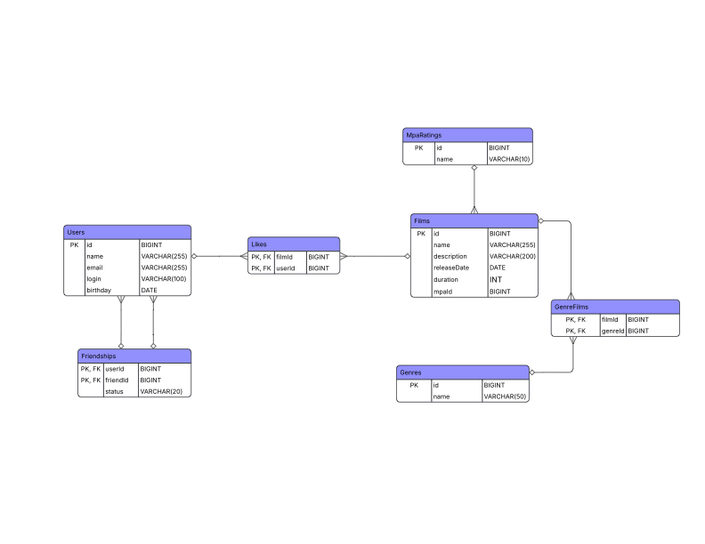

# Java-filmorate
Filmorate homework project.

### Database Diagram
Open diagram on [lucid.app](https://lucid.app/lucidchart/28dfde9b-7794-4d3b-8cef-588cc3246b7e/edit?viewport_loc=30%2C-183%2C2005%2C836%2C0_0&invitationId=inv_408a6f9a-d8d0-455d-b1df-eaf3ccdc5375)




<ins>**Request examples**</ins>

1: Get all films
```
SELECT * 
FROM films;
```
2: Get all users
```
SELECT * 
FROM users;
```
3: Get 10 most popular films
```
SELECT film_id, COUNT(*) AS likes_count
FROM likes
GROUP BY film_id
ORDER BY likes_count DESC
LIMIT 10;
```
4: Get friends of the user
```
SELECT friend_id
FROM friendships
WHERE user_id = 1 AND status = 'CONFIRMED';
```
